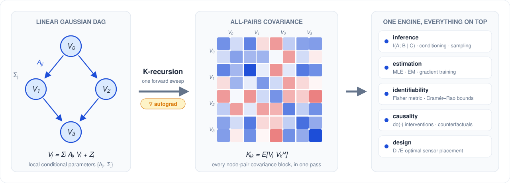

# gaussian-bn

[](LICENSE)
[](https://www.python.org/)

<p align="center">
  
</p>

A differentiable **K-recursion** covariance backend for linear Gaussian
Bayesian networks (BNs). A single topology-agnostic forward pass maps the local
conditional parameters `{A_{ji}, Σ_j}` of a linear Gaussian DAG to every
node-pair covariance block `K_{jk} = E[V_j V_k^H]`; everything else —
marginalization, conditioning, mutual information, parameter estimation,
intervention, Fisher-based identifiability, and sensor placement — is built on
that one engine.

```
V_j = Σ_{i ∈ Pa(j)} A_{ji} V_i + Z_j,   Z_j ~ N(0, Σ_j)
{A_{ji}, Σ_j}  --K-recursion-->  K_all  -->  inference / training / identifiability
```

Because the K-recursion is just matrix products, sums, and Hermitian
transposes, PyTorch autograd differentiates the whole pipeline: marginal
likelihoods, Fisher metrics, and information measures are all gradients away.

> **Status.** Research code, public-API stable for lab-internal and external
> use. The library is **real-valued by default** (`float64`) but dtype-generic:
> the same code runs under `complex128` (the Hermitian transpose `.mH` reduces
> to a transpose for real models).

This library is the **Gaussian Bayesian Network** member of the K-recursion
family; it shares the numerical core of the mutual-information-optimization
library [`gaussian-dag`](https://github.com/wadayama/gaussian-dag) but targets
*inference, estimation, and identifiability* on Gaussian BNs rather than MI
maximization.

---

## Requirements

- Python ≥ 3.12
- PyTorch ≥ 2.12 (installed as a dependency)
- [`uv`](https://docs.astral.sh/uv/) for environment management (recommended)

## Installation

```bash
git clone https://github.com/wadayama/gaussian-bn.git
cd gaussian-bn
uv sync
```

This creates `.venv/` and installs all locked dependencies from `uv.lock`. Run
any subsequent command via `uv run python …` or `uv run pytest`.

Confirm the install:

```bash
uv run pytest
```

You should see all tests pass (a few large-`N` Monte-Carlo tests are marked
`slow`; run only the fast subset with `uv run pytest -m "not slow"`).

---

## Repository layout

```
gaussian-bn/
├── gaussian_bn/     core library (12 modules; see gaussian_bn/README.md)
├── tests/           pytest suite (179 tests; see tests/README.md)
├── examples/        short, self-contained quick-start scripts (see examples/README.md)
├── experiments/     applied experiments: hidden-node EM, sensor placement,
│                    interventional information geometry, structure learning,
│                    CRB reliability, SDE estimation under subsampling,
│                    LDS state-space validation vs Kalman/RTS,
│                    skip-connected LDS, continuous D-optimal design
│                    (see experiments/README.md)
├── docs/            4-part Markdown tutorial walkthrough (see docs/README.md)
├── assets/          visual abstract + its generator script (real k_full output)
├── pyproject.toml   project metadata and dependencies (uv / pip)
├── LICENSE          MIT
├── MATH.md          implementation-side mathematical exposition
└── README.md        this file
```

Each subdirectory has its own short `README.md`. For library API and
conventions see [`gaussian_bn/README.md`](gaussian_bn/README.md); for the
tutorial sequence see [`docs/README.md`](docs/README.md).

---

## Quick start

### 1. Build a Gaussian BN and query conditional mutual information

A diamond DAG `0 → 1, 0 → 2, 1 → 3, 2 → 3`. We build the model, compute the
global covariance, and test a conditional-independence relation.

```python
import gaussian_bn as gbn

m = gbn.GaussianDAG(
    dims=[1, 1, 1, 1],
    edges={(0, 1): [[1.3]], (0, 2): [[-0.8]], (1, 3): [[0.9]], (2, 3): [[1.1]]},
    noise=[[[1.0]], [[0.4]], [[0.5]], [[0.3]]],
)

Kf = gbn.k_full(m)                                       # global covariance K_all
print(gbn.mutual_information(m, [0], [3], Kf))           # I(V0; V3)
print(gbn.conditional_mutual_information(m, [1], [2], [0], Kf))  # I(V1; V2 | V0)
```

### 2. Estimate parameters from data (full and partial observation)

```python
import torch, gaussian_bn as gbn

g = torch.Generator().manual_seed(0)
X = gbn.sample(m, 100_000, g)                            # synthetic data

# Full observation: closed-form node-wise MLE
edges_hat, noise_hat = gbn.fit_local_regression(m, X)

# Hidden middle nodes {1, 2}, observe only {0, 3}: EM on the K-recursion
fitted, nll_history = gbn.em_fit(m, X, observed=[0, 3], num_iters=60)
```

### 3. Diagnose edge identifiability with the Fisher metric

```python
report = gbn.identifiability_report(
    m, edge_params=[(0, 1), (0, 2), (1, 3), (2, 3)], observed=[0, 3],
)
print(report.identifiable, report.rank, "/", report.q)  # False 2 / 4 — a latent gauge
```

### 4. Intervene and measure the causal effect

```python
m_do = gbn.do_hard(m, node=1)                            # cut node 1 from its parents
print(gbn.mutual_information(m_do, [1], [3]))            # post-intervention association
```

Affine models (node offsets), point interventions `do(V_j = u)`, and
counterfactuals are supported:

```python
import torch
ma = gbn.GaussianDAG([1, 1, 1], {(0, 1): [[0.8]], (1, 2): [[0.9]]},
                     [[[1.0]], [[0.5]], [[0.4]]],
                     mean=[torch.tensor([2.0]), torch.tensor([-1.0]), torch.tensor([0.5])])
# "had V0 been 5 instead of the observed 3, what would V2 have been?"
cf = gbn.counterfactual(ma, evidence=[0, 1, 2], evidence_values=torch.tensor([3., 1.5, .7]),
                        do={0: torch.tensor([5.0])}, query=[2])
```

### 5. Reliability of an estimate (Cramér–Rao bound)

The Fisher information is computed analytically (Slepian–Bangs), so you get
standard errors and confidence intervals — and a clear `∞` when a parameter is
not identifiable from the chosen observations.

```python
# a model you have fitted to N observations of `observed`
report = gbn.crb_report(m, observed=[0, 1, 2, 3], N=1000)
print(report.summary())              # per-parameter estimate ± SE and 95% CI
print(report.identifiable, report.rank, "/", report.q)
```

See [`examples/`](examples/) for runnable versions and
[`docs/`](docs/) for a step-by-step tutorial.

---

## Public API

All symbols are re-exported from the top-level package
(`import gaussian_bn as gbn`). They are grouped by module below.

### Model & K-recursion

| Symbol | Module | Purpose |
| --- | --- | --- |
| `GaussianDAG(dims, edges, noise, *, dtype=None, device=None, validate=True, mean=None)` | `model` | Container for a linear Gaussian BN; validates structure, infers dtype/device, exposes `k_blocks()`. Optional per-node offset `mean` (default zero) makes the model affine `V_j = c_j + sum_i A_{ji} V_i + Z_j`. `validate="psd"` admits singular noise (deterministic nodes, e.g. exact ODE state updates observed through noisy children); query/conditioning sets must then stay nonsingular. |
| `mean_all(model)` | `model` | Stacked marginal means `(I - A)^{-1} c` via the mean recursion (zero for a zero-mean model). |
| `compute_k_blocks(num_nodes, parents, edge_mats, root_covs, noise_covs, *, ...)` | `krecursion` | Forward K-recursion → canonical blocks `K[(j,k)]` (`j ≥ k`). Supports multiple roots. |
| `get_K(K, a, b)` | `krecursion` | Read `K_{ab}`, applying the Hermitian flip `K_{ab} = K_{ba}^H` when `a < b`. |
| `k_full(model, K=None)` | `model` | Assemble the full `D × D` covariance from canonical blocks. |
| `full_covariance_closed_form(model)` | `model` | Reference covariance `(I − A)^{-1} Σ (I − A)^{-H}` (test oracle). |
| `pack(model, *, free_edges=None, noise_param="chol", ...)` / `unpack(eta, pack, base)` | `model` | Flatten a model into unconstrained autograd leaves (PD-preserving noise) and back. |

### Linear algebra (numerical core)

| Symbol | Module | Purpose |
| --- | --- | --- |
| `hermitianize(A)` | `linalg` | `(A + A^H) / 2`; enforce Hermitian structure against round-off. |
| `logdet_hpd(A, jitter=0.0)` | `linalg` | Cholesky-based `log det A` for Hermitian PD `A`. |
| `solve_psd(A, B, *, jitter=0.0)` | `linalg` | `(A + jitter·I)^{-1} B` via a Cholesky factor and triangular solves (never an explicit inverse). |
| `schur_complement(KAA, KAB, KBB, *, jitter=0.0)` | `linalg` | Hermitian Schur complement `K_{A\|B}`. |
| `cholesky_psd(A, *, jitter=0.0)` | `linalg` | Lower-triangular Cholesky factor with a PD floor. |
| `psd_factor(A, *, jitter=0.0)` | `linalg` | Factor `L` with `L L^H = A` for PSD (possibly singular) `A`; Cholesky-first, eigendecomposition fallback. |

### Inference

| Symbol | Module | Purpose |
| --- | --- | --- |
| `marginal(model, nodes, Kf=None)` | `inference` | Marginal covariance `K_AA` of a node set. |
| `conditional_covariance(model, A, B, Kf=None, *, jitter=0.0)` | `inference` | `Cov(V_A \| V_B)` via the Schur complement. |
| `conditional_mean(model, A, B, b, Kf=None, *, jitter=0.0)` | `inference` | `E[V_A \| V_B = b] = K_AB K_BB^{-1} b`. |
| `mutual_information(model, A, B, Kf=None, *, jitter=0.0)` | `inference` | `I(V_A; V_B)` (log-det, nats). |
| `conditional_mutual_information(model, A, B, C, Kf=None, *, jitter=0.0)` | `inference` | `I(V_A; V_B \| V_C)` (log-det, nats). |
| `sample(model, N, generator)` | `inference` | Draw `N` i.i.d. samples of `V_all` (real or complex). |

### Training / estimation

| Symbol | Module | Purpose |
| --- | --- | --- |
| `fit_local_regression(model, X, *, ridge=0.0, fit_mean=False)` | `training` | Full-observation closed-form node-wise MLE; `fit_mean=True` also recovers the affine offsets → `(edges, noise, mean)`. |
| `local_mle_from_cov(model, Kmat, *, ridge=0.0)` | `training` | Node-wise MLE from a covariance (sample or EM expected-sufficient). |
| `gaussian_nll(K_OO, S, *, jitter=0.0)` | `training` | Observed-block Gaussian NLL `log det K_OO + tr(K_OO^{-1} S)`. |
| `marginal_likelihood(model, patterns, *, jitter=0.0)` | `training` | Multi-pattern / missing-data observed-data NLL (differentiable). |
| `posterior_full_moments(model, observed, Y, Kf=None, *, jitter=0.0)` | `training` | EM E-step expected sufficient statistic. |
| `em_fit(model, X, observed, num_iters, *, ridge=0.0, jitter=0.0)` | `training` | EM for hidden-node BNs → `(model, nll_history)`. |
| `fit_gradient(model, patterns, *, optimizer="adam"\|"lbfgs", ...)` | `training` | Autograd marginal-likelihood training (free, independent edges) → `(model, nll_history)`. |
| `fit_gradient_custom(params, build_model, patterns, *, ...)` | `training` | Train a custom edge parametrization — shared / factored (`A_{ji}=H_{ji}F_i`) / low-rank / tied — via a user closure; autograd differentiates through any edge construction. Returns the NLL history. |
| `ObsPattern(observed, Y)` | `training` | An observation pattern (observed nodes + data). |

### Identifiability

| Symbol | Module | Purpose |
| --- | --- | --- |
| `fisher_metric(K_of_eta, eta0, *, method="autograd"\|"fd", ...)` | `identifiability` | Pullback Fisher metric of a map `η → K_OO`; returns `(G, eigvals, eigvecs)`. |
| `edge_fisher(model, edge_params, observed, *, method="autograd", ...)` | `identifiability` | Fisher metric over chosen edges for an observed set. |
| `identifiability_report(model, edge_params, observed, *, ...)` | `identifiability` | Rank, condition number, null directions, per-parameter sensitivity. |
| `fisher_metric_differentiable(K_of_eta, eta0, *, jitter=0.0)` | `identifiability` | Nested-AD variant: returns `G` with the autograd graph intact, so design objectives like `logdet G(θ)` can be optimized by gradient ascent (reverse-mode through the inner forward-mode Jacobian). |
| `IdentifiabilityReport` | `identifiability` | Result dataclass of the above. |

### Reliability (Cramér–Rao bound)

The Fisher information above is exactly the **Slepian–Bangs** information of the
zero-mean observed Gaussian, computed analytically from the K-recursion (no
sampling). Inverting it gives the **Cramér–Rao bound** `(N F)^{-1}` — asymptotic
standard errors and confidence intervals for MLE/EM estimates, with
non-identifiable directions reported as `SE = ∞`.

| Symbol | Module | Purpose |
| --- | --- | --- |
| `parameter_fisher(model, observed, *, free_edges=None, noise_param="fixed", include_mean=False, ...)` | `reliability` | Per-sample Slepian–Bangs FIM over chosen parameters (edges, optionally noise); `include_mean=True` adds the mean term for affine models with known offsets → `(F, eigvals, eigvecs, labels)`. |
| `crb(model, observed, N, *, free_edges=None, noise_param="fixed", include_mean=False, ...)` | `reliability` | Cramér–Rao bound matrix `(N F)^{-1}` (pseudo-inverse if rank-deficient). |
| `crb_report(model, observed, N, *, confidence=0.95, theta_hat=None, ...)` | `reliability` | Standard errors, confidence intervals, identifiability flags; has a `.summary()` table. |
| `CRBReport` | `reliability` | Result dataclass of `crb_report`. |

### Intervention

| Symbol | Module | Purpose |
| --- | --- | --- |
| `do_hard(model, node, *, value=None, cov=None)` | `intervention` | Cut a node from its parents: a mechanism intervention, or a point intervention `do(V_node = value)` (deterministic, needs a mean-carrying model). Returns a new model. |
| `do_soft(model, node, *, edges=None, noise=None)` | `intervention` | Replace a node's incoming edges / noise. Returns a new model. |
| `do_covariance(model, node, *, cov=None)` | `intervention` | Full covariance after `do(node)`. |
| `do_cmi(model, node, A, B, C, *, cov=None, jitter=0.0)` | `intervention` | CMI on the intervened model. |
| `counterfactual(model, evidence, evidence_values, do, query, *, jitter=0.0)` | `intervention` | Counterfactual `E[V_query \| V_evidence = e ; do(V_j = u_j)]` by abduction–action–prediction. |

### Design & optimization

| Symbol | Module | Purpose |
| --- | --- | --- |
| `sensor_placement(model, edge_params, candidate_nodes, budget, *, criterion="d"\|"e", method="greedy"\|"exhaustive", ...)` | `design` | D-/E-optimal observation design → `SensorPlacement`. |
| `d_optimal_score(G, *, eps=1e-9)` / `e_optimal_score(G, *, eps=1e-9)` | `design` | `logdet(G+εI)` / `λ_min(G+εI)` optimality scores. |
| `SensorPlacement` | `design` | Result dataclass (chosen set, score, per-step trace). |
| `pga_ascent(compute_objective, params, *, step_size, num_iters, projector=None)` | `optimize` | Constant-step projected gradient ascent. |
| `natural_gradient_step(...)` / `natural_gradient_ascent(...)` | `optimize` | Fisher-preconditioned (Riemannian) ascent. |
| `project_frobenius_ball(A, P)` / `project_total_power(params, P)` | `projections` | Frobenius-ball / shared-budget projections. |

### Conventions

- **Indexing.** Nodes are 0-based in topological order: every edge key `(i, j)`
  satisfies `i < j`. Any parentless node is an independent **root** (multiple
  roots are supported).
- **Storage.** `compute_k_blocks` returns canonical lower-triangular blocks
  (`j ≥ k`); use `get_K` for symmetric access.
- **dtype.** Default `float64`. `GaussianDAG` infers dtype/device from the
  tensors you pass; built from Python lists it defaults to `float64`. Pass
  `complex128` tensors for circular-complex Gaussian models.
- **Units.** Mutual information and CMI are in **nats** (natural log), with the
  `1/2 log-det` convention for real models and the `1 log-det` convention for
  circular-complex models.
- **Numerical hardening.** All conditioning uses a Cholesky factorization and
  triangular solves (never an
  explicit inverse); every returned covariance is re-symmetrized; an optional
  `jitter` floors the positive-definite cone on Cholesky / log-det / solve
  paths.

---

## Examples and experiments

- [`examples/`](examples/) — short, self-contained scripts for the quick-start
  patterns above (inference, training, intervention).
- [`experiments/`](experiments/) — ten applied experiments, each reproducible
  via `uv run python experiments/<script>.py`: hidden-node EM vs gradient
  training, Fisher-based sensor placement, interventional information geometry,
  structure learning by group-sparsity pruning, CRB estimator reliability,
  accuracy-declared SDE (Ornstein–Uhlenbeck) parameter estimation under
  subsampled observation, a linear Gaussian state-space running example
  validated against the Kalman filter / RTS smoother, its skip-connected
  (non-chain) extension validated against a companion-form Kalman recursion,
  sensor-network self-calibration on a fusion DAG (gauge staircase +
  placement-quality CRB), and continuous D-optimal design by nested automatic
  differentiation.
  See [`experiments/README.md`](experiments/README.md).

All experiment numbers come from actual code execution (results are written to
`experiments/results/*.json`); no values are hand-edited.

---

## Tutorials

A step-by-step walkthrough is under [`docs/`](docs/):

1. [Installation and your first inference](docs/tutorial-1-installation-and-inference.md)
2. [Building a Gaussian BN and reading K-blocks](docs/tutorial-2-building-a-bn.md)
3. [Estimation: local regression, marginal likelihood, and EM](docs/tutorial-3-estimation.md)
4. [Identifiability, intervention, and sensor placement](docs/tutorial-4-identifiability-and-design.md)

---

## Known limitations

- **Linear Gaussian only.** Nonlinear node elements (saturating amplifiers,
  quantizers) are out of scope.
- **Optimization.** `fit_gradient` / `pga_ascent` are intentionally minimal;
  for non-convex objectives, multi-start is recommended.
- **Identifiability cost.** `fisher_metric` uses an `O(q)` forward-mode
  autograd Jacobian (one sweep per parameter, with a reverse-mode fallback);
  a finite-difference fallback (`method="fd"`) is also provided.
- **CRB is asymptotic.** The Cramér–Rao bound lower-bounds *unbiased* estimators;
  MLE/EM attain it as `N → ∞`, so `crb_report` standard errors and confidence
  intervals are asymptotic. Noise CRBs are reported in the chosen
  (`chol` / `logdiag`) parametrization. Complex-parameter CRBs would need the
  widely-linear extended Fisher (the library is real-centric).
- **GPU / MPS.** The library is device-agnostic, but as of PyTorch 2.12 Apple
  MPS lacks `float64` and complex `linalg`; use CPU (or CUDA) for the standard
  `float64` / `complex128` workflows.

---

## Citation

A paper describing the K-recursion Gaussian BN framework is in preparation. If
you use this library before it appears, please cite the repository:

```bibtex
@software{wadayama2026gaussianbn,
  author  = {Wadayama, Tadashi},
  title   = {gaussian-bn: A K-Recursion Covariance Backend for
             Linear Gaussian Bayesian Networks},
  year    = {2026},
  url     = {https://github.com/wadayama/gaussian-bn},
}
```

The citation will be updated with the paper reference once it is available.

---

## License

`gaussian-bn` is released under the [MIT License](LICENSE).
